# GoogleMeet Scheduler

##  About this application

[On PlayStore](https://play.google.com/store/apps/details?id=com.bee.meetscheduler)

[My Develop Note on Notion](https://www.notion.so/GoogleMeetSchedule-InProgress-8d245e60dc8a48258e256cc40ee184f7)

## Icons
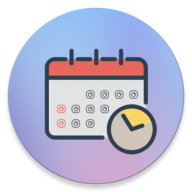

## Views

### Home
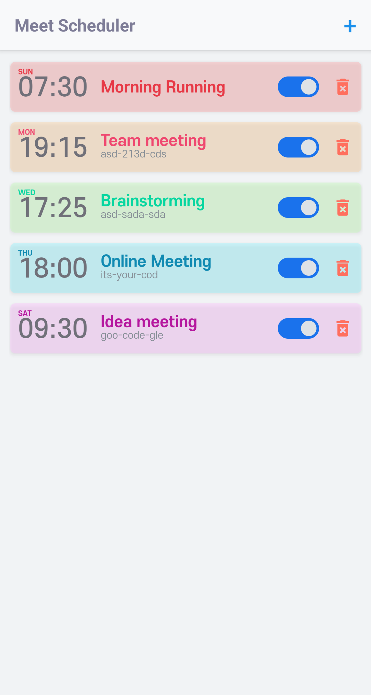 &nbsp;&nbsp;
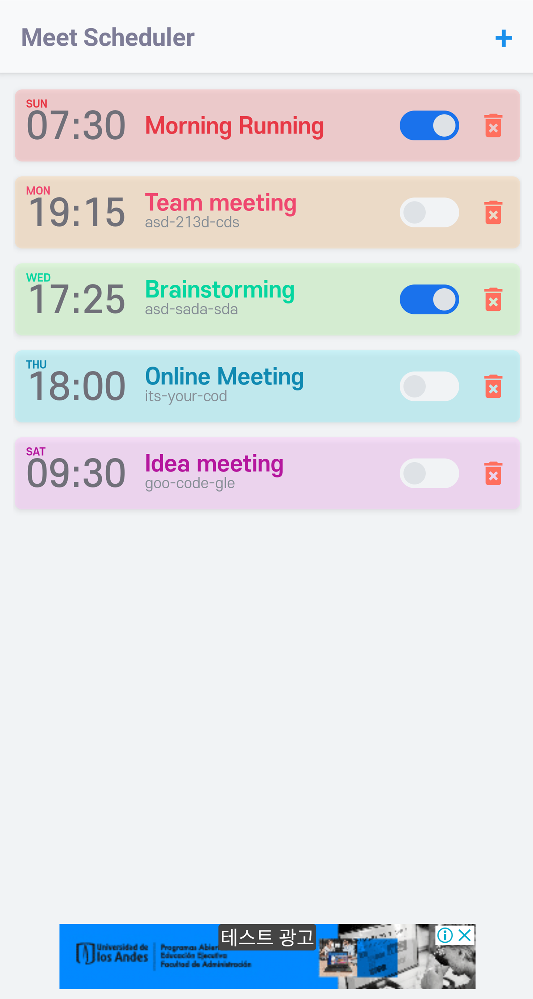

### Dialogs (OpenLink / Delete)
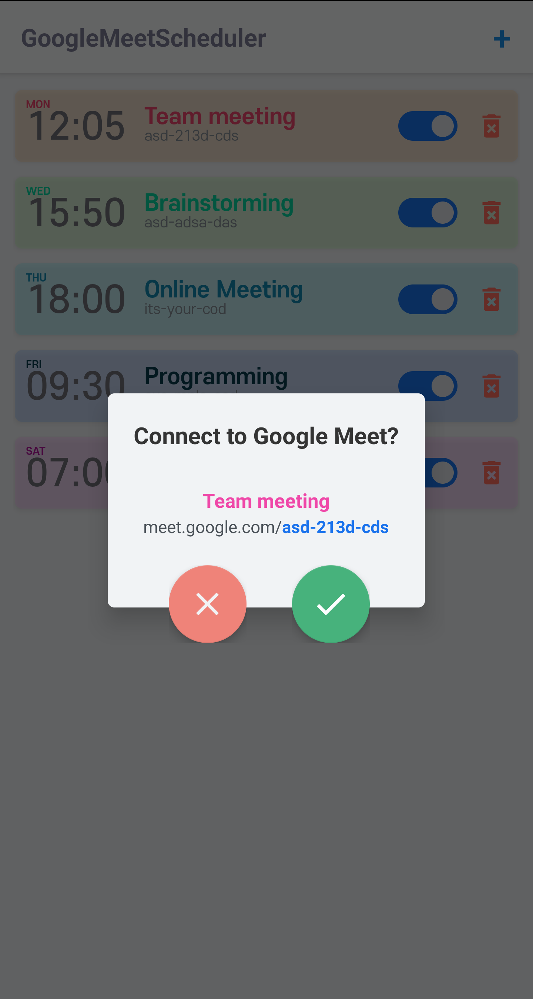 &nbsp;&nbsp;
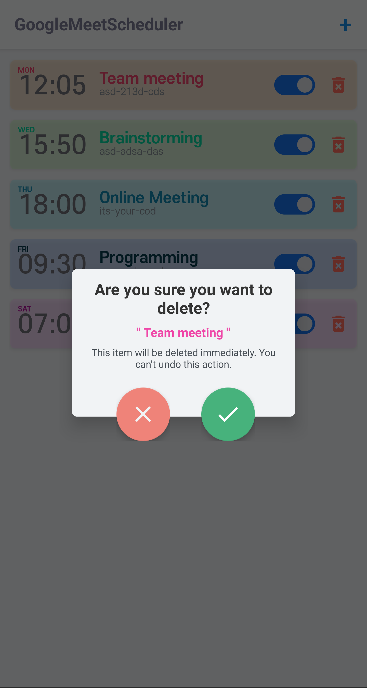

### Add
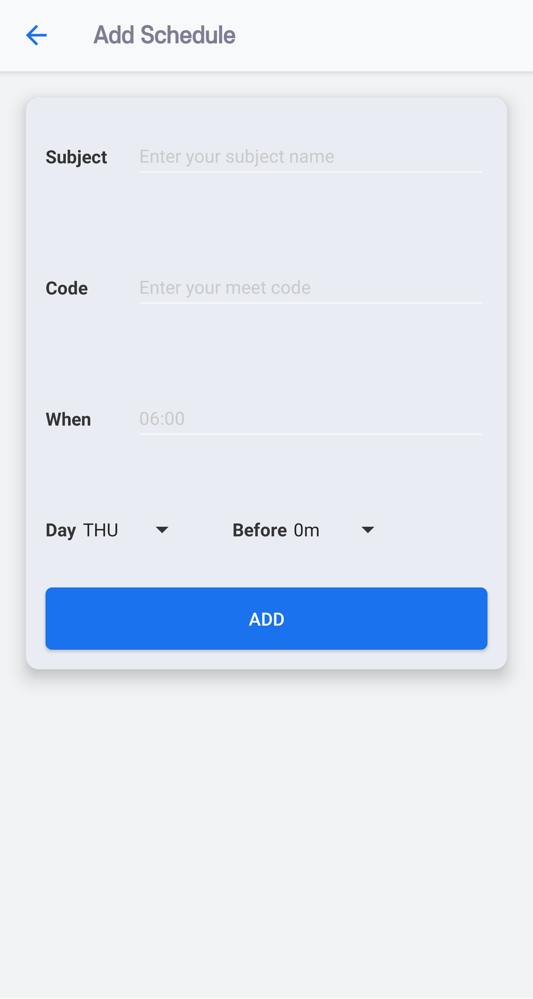 &nbsp;&nbsp;
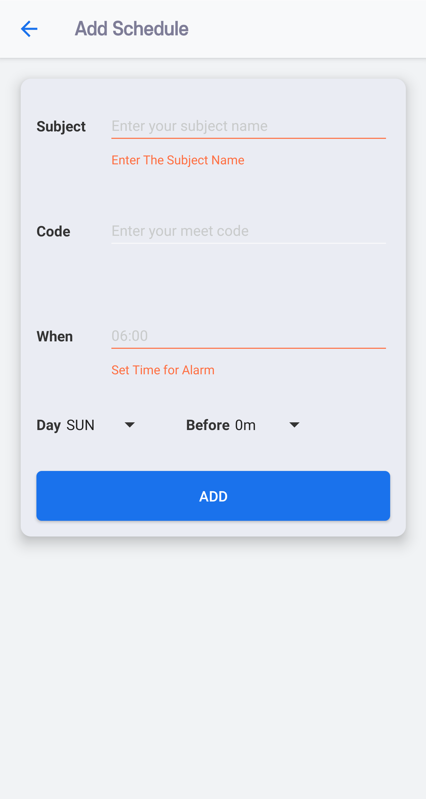 &nbsp;&nbsp;
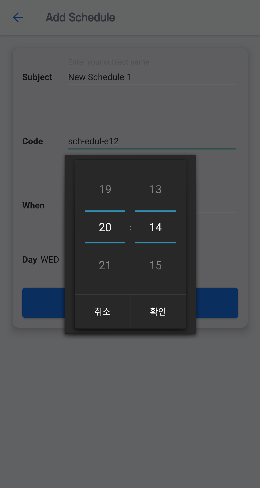 &nbsp;&nbsp;
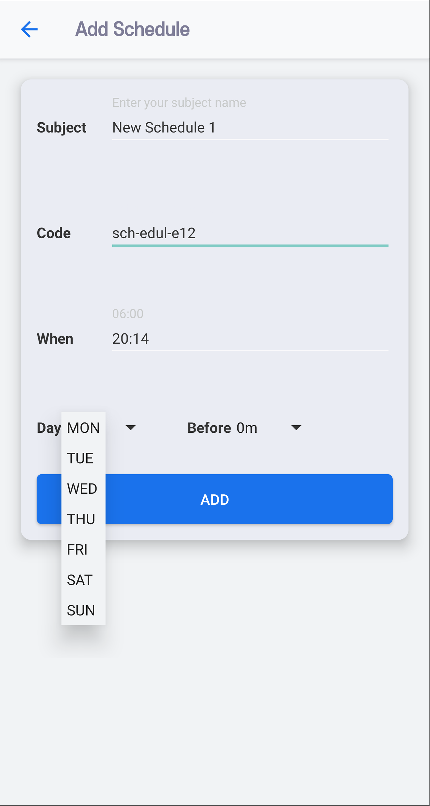 &nbsp;&nbsp;
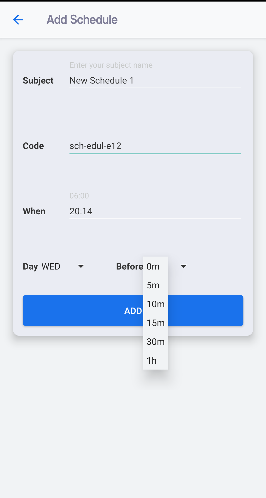

### Detail - with memo
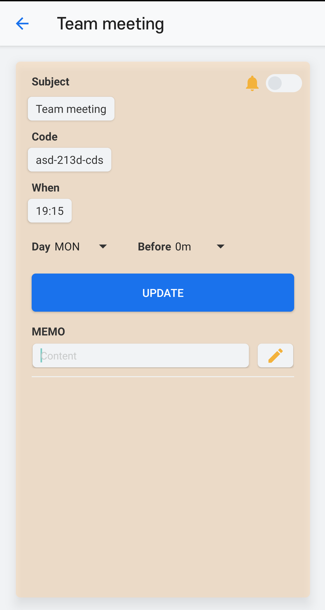 &nbsp;&nbsp;
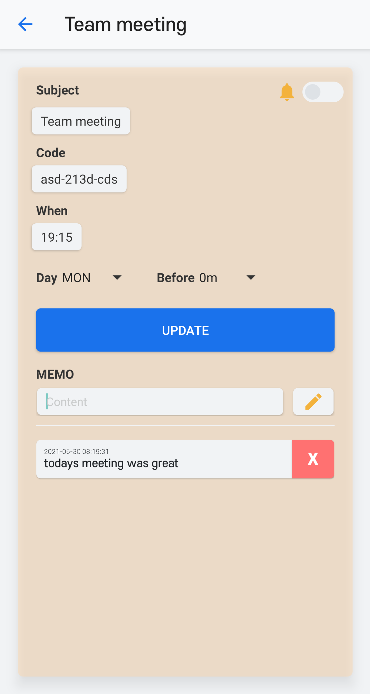